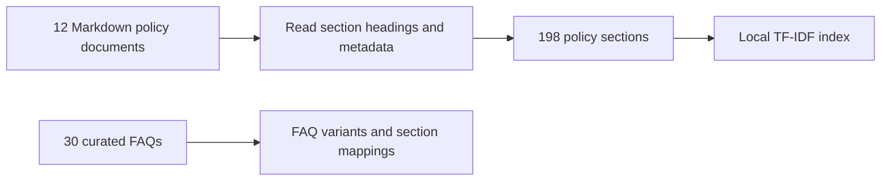
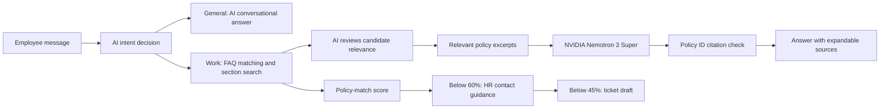
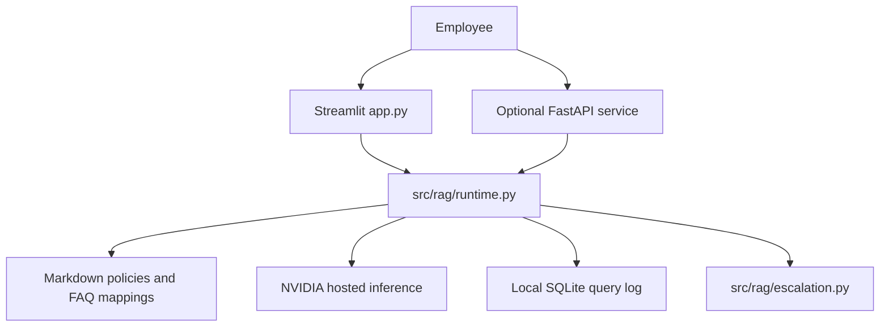

# HR Policy LLM RAG Assistant


**Policy-backed answers. Clear HR contacts. Optional HR ticket drafts when the policy match is weak.**

### Executive Summary

A **Retrieval-Augmented Generation (RAG)** assistant for employees at a fictional retailer. It answers HR questions using a documented knowledge base, retrieves relevant policy sections, and uses **NVIDIA Nemotron 3 Super** (`nvidia/nemotron-3-super-120b-a12b`) to produce clear answers with policy citations.

The working demo includes **12 policy documents, 198 indexed sections, and 30 curated FAQs**. A Streamlit employee workspace provides chat, policy search, HR contacts, recent conversations, and a highlighted policy-match score. Retrieval runs locally on CPU; generation uses NVIDIA's hosted API.

**Standout feature: confidence-based HR escalation.**

| Policy-match score | Action |
|---|---|
| **60% or above** | Normal policy-backed answer |
| **45% to below 60%** | Guidance plus a recommendation to contact HR and contact details |
| **Below 45%** | Show a Create HR ticket button; clicking creates a draft with a unique ID and download option |

Tickets are drafts, not submissions to an HR system. A configured real HR email enables a button that opens an email draft for the employee to review and send. The score measures retrieval relevance, **not the probability that an answer is correct**.

### Business Problem

HR departments in mid-to-large enterprises field **hundreds of policy-related questions daily** -- vacation accrual, benefits eligibility, remote work rules, performance review timelines, onboarding checklists, and code-of-conduct clarifications. The traditional approach relies on HR generalists manually searching policy documents and crafting individual responses. This process is:

- **Slow** -- employees may wait days for routine answers in the challenge scenario.
- **Inconsistent** -- different agents interpret policies differently.
- **Error-prone** -- outdated information or incorrect citations erode trust.
- **Unscalable** -- headcount grows linearly with query volume.

Large Language Models (LLMs) can generate fluent answers but **hallucinate freely** when not grounded in source material. RAG reduces this risk by combining LLM fluency with retrieved policy evidence. Answers display policy-section references and expandable source excerpts for review.

### Architecture

#### Ingestion Pipeline



#### Query Pipeline



#### System Overview



Streamlit calls the runtime directly by default. A separate FastAPI deployment is optional. LangChain, MiniLM, and ChromaDB modules remain in the repository as reference code; they are not used by the current Streamlit serving path.

### Data Model

The knowledge base contains **12 fictional HR policy documents**, **198 sections**, and **30 mapped FAQs**:

| Policy | Document | Main topic |
|---|---|---|
| POL-001 | `vacation_leave_policy.md` | Annual leave, entitlement, requests, carryover |
| POL-002 | `benefits_handbook.md` | Benefits and eligibility |
| POL-003 | `remote_work_policy.md` | Remote work and international work requests |
| POL-004 | `onboarding_guide.md` | Joining, training, and onboarding |
| POL-005 | `performance_review_policy.md` | Reviews, ratings, and development |
| POL-006 | `code_of_conduct.md` | Ethics, conduct, and reporting |
| POL-007 | `attendance_timekeeping.md` | Clocking in, missed time, and attendance |
| POL-008 | `payroll_expenses.md` | Payslips, pay corrections, and expenses |
| POL-009 | `shift_scheduling.md` | Rosters, shift swaps, and overtime |
| POL-010 | `retail_employee_services.md` | Uniforms, discounts, badges, and employee services |
| POL-011 | `sick_emergency_leave.md` | Sick leave and emergency leave |
| POL-012 | `hr_support_contacts.md` | HR, payroll, store support, and escalation |

Each indexed section includes a policy ID, title, version, section path, source filename, and text. FAQ entries in `docs/faq.json` map common question variants to explicit section IDs.

### RAG Pipeline

#### 1. Document Loading & Metadata Extraction

`src/rag/runtime.py` reads Markdown policies and extracts policy numbers, titles, versions, and section headings. Source metadata remains attached to retrieved text for citations.

#### 2. Chunking Strategy

Policies are split at level-two and level-three Markdown headings. This preserves complete policy sections instead of cutting them into arbitrary overlapping token windows.

#### 3. Retrieval Representation

scikit-learn TF-IDF represents words and word pairs in policy text. FAQ matching combines word similarity with character n-grams to handle common wording variations. No embedding model download or local GPU is required.

#### 4. Retrieval Index

The index is built in memory from the documents when the runtime starts. Updating policy files and restarting or re-indexing refreshes the knowledge base.

#### 5. Retrieval

- **Top-K:** up to 5 sections for general section search.
- **Retrieval cutoff:** defaults to `0.15`; this determines which sections can be supplied as evidence.
- **FAQ routing:** requires a distinct match of at least `0.42` and maps to specified policy sections.
- **Human escalation thresholds:** below `0.60` recommends HR; below `0.45` offers a Create HR ticket button.

The retrieval cutoff and human escalation thresholds serve different purposes. Vague or unsupported questions receive clarification suggestions.

#### 6. Generation

- **Provider:** NVIDIA hosted inference at `https://integrate.api.nvidia.com/v1`.
- **Model:** `nvidia/nemotron-3-super-120b-a12b`.
- **Temperature:** `0.2`; **maximum output tokens:** `1024`.
- **System prompt:** `src/rag/answer_prompt.py` requests concise, practical answers supported by the supplied excerpts, with compact policy-section citations.

#### 7. Guardrails & Citation

The live runtime checks that generated answers cite supplied policy IDs. Missing or invalid policy IDs and answer-generation failures produce documented source excerpts after successful AI routing. A missing API key prevents routing and produces a service error. It does not independently verify every section reference or factual claim.

### RAG vs Fine-tuning

| Aspect | RAG (this project) | Fine-tuning |
|--------|---------------------|-------------|
| **Cost** | Low -- API calls only | High -- training compute + data curation |
| **Data freshness** | Instant -- update policy docs and re-index | Requires full retraining cycle |
| **Hallucination risk** | Lower -- grounded in retrieved documents | Higher -- model memorizes patterns |
| **Citation support** | Yes -- full source tracking per chunk | No -- no built-in provenance |
| **Deployment** | Simpler -- no model hosting | Complex -- GPU infrastructure needed |
| **Update cadence** | Minutes (re-index) | Days to weeks (retrain + deploy) |
| **Best for** | FAQ, policies, documentation, compliance | Style/tone adaptation, domain specialization |

RAG is a practical choice for this demo because policy documents can be updated without retraining the model and retrieved sources can be displayed alongside answers.

### Guardrails & Anti-Hallucination

The current serving path combines four practical controls:

1. **Grounded prompt:** the model receives retrieved excerpts and instructions to avoid inventing entitlements, forms, contacts, deadlines, or approvals.
2. **Citation check:** generated policy IDs must belong to the supplied evidence; failed checks return source excerpts.
3. **Useful fallback:** unavailable generation returns the documented guidance directly; missing evidence offers clarification.
4. **Human escalation:** scores below 60% show HR contact guidance; scores below 45% also offer a button to create a downloadable ticket draft.

The separate `guardrails.py` module contains additional legacy heuristics, but those are not part of the current Streamlit runtime. Grounding and citation checks reduce risk; they do not guarantee factual correctness.

### Evaluation Framework

Automated tests verify FAQ routing, policy metadata, API responses, service failure handling, citation fallback, workspace navigation, and ticket escalation.

The escalation tests cover both threshold boundaries: exactly **45%** recommends HR without a ticket, and exactly **60%** uses the normal answer flow. A regression test checks that a retained **18%** response offers a ticket button and keeps the same ticket ID after creation across reruns.

The repository also retains an evaluation harness for the earlier pipeline. Its simulated metrics are not measured results for the current app.

### Results

Current verification is reported as functional checks rather than unsupported accuracy or business-impact percentages:

| Check | Status |
|---|---|
| Focused runtime, UI, API, and escalation suite | 60 tests passed |
| Policy knowledge base | 12 documents / 198 sections |
| Curated FAQ routing | All 30 canonical FAQ mappings tested |
| NVIDIA generation | Tested with live API calls during development |
| Confidence escalation | Boundary tests and 18% ticket regression covered |
| Chat navigation, policy search, and HR contacts | Streamlit AppTest coverage |
| Public Streamlit deployment | https://hackathon-mih.streamlit.app/ (user deployed; live UI not independently inspected) |

The focused runtime/UI/API suite is run before pushing updates. These tests do not measure production accuracy, traffic capacity, or HR time savings.

### Governance & Risk Management

| Area | Approach |
|---|---|
| **Demo data** | Fictional policy documents; employee questions may still contain personal information. |
| **Model configuration** | NVIDIA model ID set through server-side environment variables or Streamlit secrets. |
| **Prompt handling** | Fixed system prompt instructs the model to treat questions and excerpts as data. |
| **Output monitoring** | Query log records answer, citations, match score, and runtime flags. |
| **Human review** | HR recommendation below 60%; ticket creation button below 45%. |
| **Ticket forwarding** | Employee reviews and sends the email draft; no automatic outbound submission. |
| **Audit trail** | Local SQLite log; permanent online storage is outside this demo's scope. |

### Limitations

- **Fictional policies and contacts:** this is a hackathon demo, not an actual employer's guidance. Default `.example` contact addresses are not monitored.
- **English knowledge base:** policies and curated questions are in English.
- **Conversation context:** recent conversations are retained in the active Streamlit session, but each question is interpreted and retrieved independently; previous messages are not sent as model context.
- **Text only:** the live runtime reads Markdown, not scanned PDFs or images.
- **Open demo access:** all demo policies are visible; role-based access is outside the chosen scope.
- **NVIDIA availability:** intent routing and generation depend on API access and quota; routing failures show a service error, while answer failures can fall back to policy excerpts.
- **Match score:** lexical relevance is not calibrated answer accuracy.
- **Ticket drafts:** no connected HR ticketing system or automatic email sending. Session history and ticket drafts may be lost when the session ends; tickets can be downloaded.
- **Deployment:** a public app is deployed on Streamlit Community Cloud; hosting and API quotas apply.

### Ethical Considerations

- **Bias in LLM Responses** -- LLMs can reflect biases from training data. HR policy answers must be reviewed periodically to ensure equitable treatment across employee demographics.
- **Employee Data Privacy** -- While this demo uses synthetic data, any production deployment must comply with GDPR, CCPA, and organizational privacy policies.
- **Over-reliance on Automation** -- The system is a decision-support tool, not a decision-maker. Critical HR decisions (terminations, accommodations, legal matters) must always involve qualified HR professionals.
- **Transparency** -- Employees should be informed when interacting with an automated system rather than a human HR representative.

### How to Run

Use Python 3.11 or 3.12. No local GPU is required.

```bash
git clone https://github.com/shikharivv/hackathon.git
cd hackathon
python -m venv .venv
```

Activate the environment:

```powershell
# Windows PowerShell
.\.venv\Scripts\Activate.ps1
Copy-Item .env.example .env
```

```bash
# macOS / Linux
source .venv/bin/activate
cp .env.example .env
```

Install dependencies and edit `.env` with your NVIDIA key:

```bash
python -m pip install -r requirements.txt
python -m streamlit run app.py
```

```dotenv
NVIDIA_API_KEY=your-secret-key
NVIDIA_MODEL=nvidia/nemotron-3-super-120b-a12b
CONFIDENCE_THRESHOLD=0.15
APP_MODE=direct
# Optional: configure a real demo inbox and approved support channel
HR_CONTACT_EMAIL=your-hr-email@example.org
HR_CONTACT_CHANNEL=Your HR support channel
```

Open `http://localhost:8501`. Indexing happens automatically. Keep `.env` private.

For the optional API:

```bash
python -m uvicorn src.api.main:app --host 127.0.0.1 --port 8000
```

To run the focused verification suite:

```bash
python -m pip install pytest
python -m pytest tests/test_conversation.py tests/test_escalation.py tests/test_workspace_navigation.py tests/test_hosted_runtime.py tests/test_faq_retrieval.py tests/test_api.py tests/test_config.py tests/test_guardrails.py -q
```

#### Streamlit Community Cloud

Connect this GitHub repository at [share.streamlit.io](https://share.streamlit.io), select branch `main`, entrypoint `app.py`, and Python 3.12. Add the NVIDIA key, model ID, and optional HR contact settings through Streamlit's server-side secrets. No separate FastAPI server is required. See [HOSTING.md](HOSTING.md) for configuration details.

### Project Structure

```
hackathon/
├── src/
│   ├── __init__.py
│   ├── api/
│   │   ├── __init__.py
│   │   ├── main.py              # FastAPI application entry point
│   │   ├── routes.py            # API route definitions
│   │   └── schemas.py           # Pydantic request/response models
│   ├── config/
│   │   ├── __init__.py
│   │   └── settings.py          # Centralized configuration (Pydantic Settings)
│   ├── data/
│   │   ├── __init__.py
│   │   └── sample_queries.py    # Evaluation query bank
│   ├── evaluation/
│   │   ├── __init__.py
│   │   └── evaluator.py         # Evaluation harness and metrics
│   ├── rag/
│   │   ├── __init__.py
│   │   ├── runtime.py           # Active TF-IDF / FAQ retrieval and NVIDIA generation
│   │   ├── answer_prompt.py     # Grounded answer style and citation instructions
│   │   ├── escalation.py        # HR recommendation and user-created ticket drafts
│   │   ├── chain.py             # RAG orchestration chain
│   │   ├── document_loader.py   # Policy document loader
│   │   ├── embeddings.py        # Embedding model wrapper
│   │   ├── guardrails.py        # Anti-hallucination guardrails
│   │   ├── llm_provider.py      # LLM provider abstraction
│   │   └── vector_store.py      # ChromaDB vector store operations
│   └── ui/
│       ├── __init__.py
│       └── app.py               # Streamlit dashboard
├── tests/
│   ├── __init__.py
│   ├── conftest.py              # Shared pytest fixtures
│   ├── test_api.py
│   ├── test_chain.py
│   ├── test_config.py
│   ├── test_document_loader.py
│   ├── test_embeddings.py
│   ├── test_evaluator.py
│   ├── test_guardrails.py
│   ├── test_llm_provider.py
│   └── test_vector_store.py
├── data/
│   ├── raw/                     # Raw input data (if applicable)
│   └── vectorstore/             # Persisted ChromaDB data
├── docs/
│   ├── architecture/
│   │   ├── data_dictionary.md
│   │   ├── rag_explained.md
│   │   └── system_design.md
│   ├── faq.json                 # 30 common FAQs mapped to policy sections
│   └── policies/
│       ├── attendance_timekeeping.md
│       ├── hr_support_contacts.md
│       ├── payroll_expenses.md
│       ├── retail_employee_services.md
│       ├── shift_scheduling.md
│       ├── sick_emergency_leave.md
│       ├── benefits_handbook.md
│       ├── code_of_conduct.md
│       ├── onboarding_guide.md
│       ├── performance_review_policy.md
│       ├── remote_work_policy.md
│       └── vacation_leave_policy.md
├── docker/
│   ├── Dockerfile.api
│   └── Dockerfile.dashboard
├── notebooks/                   # Exploratory analysis notebooks
├── assets/                      # Static assets (images, diagrams)
├── docker-compose.yml
├── Makefile
├── pyproject.toml
├── requirements.txt
├── requirements-dev.txt
├── .streamlit/config.toml       # Dark workspace theme
├── app.py                       # Streamlit Cloud entrypoint
├── HOSTING.md                   # Hosting configuration
├── LICENSE
└── README.md
```

### Interview Talking Points

- **RAG design:** retrieve documented policy sections before asking the model to answer.
- **Practical retrieval:** combine curated FAQ mappings with lightweight TF-IDF search for a CPU-only demo.
- **Confidence-based escalation:** use separate 60% and 45% thresholds for HR guidance and ticket creation.
- **Employee experience:** offer readable answers, highlighted match scores, policy search, HR contacts, and recent conversations.
- **Resilient generation:** show source excerpts if the model is unavailable or fails citation checks.
- **Verification:** test threshold boundaries, stable ticket IDs, FAQ routing, and UI navigation.

Suggested demo: ask a known leave question, demonstrate an uncertain question with HR guidance, then show a below-45% question offering a ticket button, then click to create a downloadable draft.

### Portfolio Positioning

This project demonstrates three core competencies:

1. **LLM application development:** hosted NVIDIA inference, a grounded prompt, and a usable Streamlit interface.
2. **RAG engineering:** policy parsing, metadata tracking, FAQ routing, lexical retrieval, and source presentation.
3. **Human hand-off design:** turn uncertain questions into HR contact guidance and reviewable ticket drafts.

### HR Tech Connection

The project demonstrates patterns commonly useful in HR technology:

| Capability | Application |
|---|---|
| Policy self-service | Employees find documented guidance without searching multiple handbooks. |
| Source visibility | Policy references make guidance easier to review. |
| HR helpdesk hand-off | Low-match questions become ticket drafts instead of dead ends. |
| Employee support workspace | Chat, policy search, and contacts are accessible in one interface. |

These are architectural use cases, not integrations with Workday, SAP, or ServiceNow.

### Business Impact

Expected benefits to validate with real users:

| Current problem | Intended benefit |
|---|---|
| Employees wait for routine answers | Immediate guidance for supported policy questions |
| Repeated manual handbook searches | A searchable policy workspace with cited answers |
| Unclear next step when the assistant is unsure | Visible HR contacts and confidence-based escalation |
| Employees must restate unresolved questions | Ticket drafts prepared after a user click |

No production time savings, accuracy percentage, or throughput improvement has been measured. The hackathon demo demonstrates the workflow.

### Maintainer

**shikharivv**

- GitHub: [github.com/shikharivv](https://github.com/shikharivv)

### License

This project is licensed under the **MIT License** -- see the [LICENSE](LICENSE) file for details.

### AI intent routing and reasoning mode

Every message is interpreted by NVIDIA first. The model decides between general conversation and work guidance; greetings and general replies are generated by the model, not predefined messages. General replies have no policy score or ticket controls.

For work questions, the model proposes a policy search query. The runtime retrieves candidate sections, and the AI reviews whether they actually address the question before generating an answer. If none is relevant, it writes a tailored response, shows HR contact guidance, and offers **Create HR ticket**. Clicking the button creates a draft; it never creates or sends a ticket automatically.

All NVIDIA requests set `chat_template_kwargs.enable_thinking` to `false`. Routing and relevance review use structured JSON, and only final answers are displayed. A working NVIDIA key is now required for AI intent routing; failures are shown explicitly rather than presented as canned AI replies. Policy excerpts remain a fallback if answer generation fails after routing.

This adds API calls and latency: a general reply normally needs one model request; a work reply can need routing, relevance review, and answer generation. AI classification and relevance assessment can still make mistakes.
