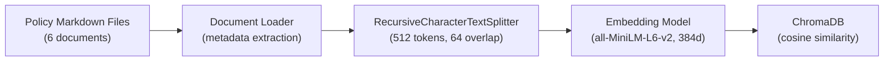
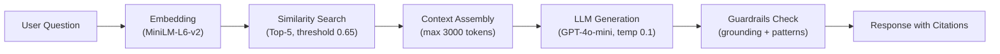
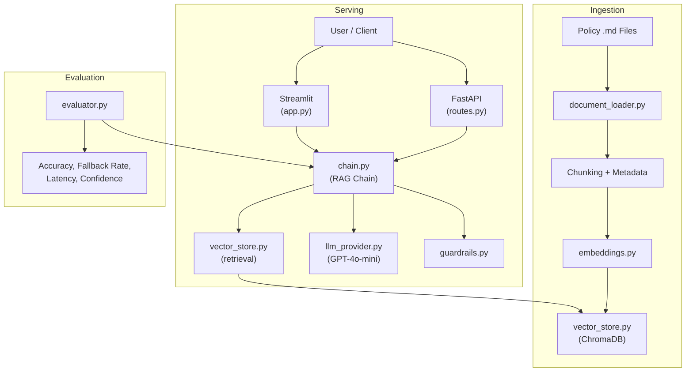
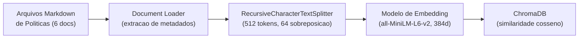
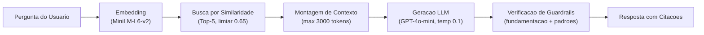
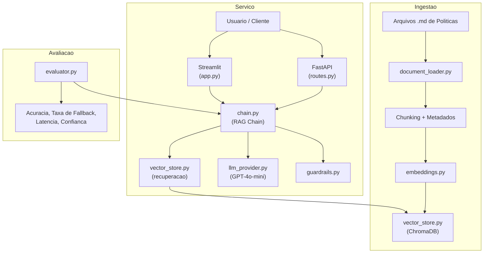

# HR Policy LLM RAG Assistant


[Portugues](#portugues) | [English](#english)

---

## English

### Executive Summary

A production-grade **Retrieval-Augmented Generation (RAG)** assistant purpose-built for **HR policy question-answering**. The system ingests internal policy documents, splits them into semantically meaningful chunks, encodes them into dense vector embeddings stored in ChromaDB, and retrieves the most relevant context for every user query. A large language model then generates grounded, citation-backed answers while a multi-layered guardrail framework prevents hallucination, blocks dangerous advice patterns, and triggers graceful fallbacks when confidence is insufficient. A comprehensive evaluation harness measures faithfulness, relevance, correct-fallback rate, and latency across 30+ curated test questions.

### Business Problem

HR departments in mid-to-large enterprises field **hundreds of policy-related questions daily** -- vacation accrual, benefits eligibility, remote work rules, performance review timelines, onboarding checklists, and code-of-conduct clarifications. The traditional approach relies on HR generalists manually searching policy documents and crafting individual responses. This process is:

- **Slow** -- average resolution time of 4-8 hours per ticket.
- **Inconsistent** -- different agents interpret policies differently.
- **Error-prone** -- outdated information or incorrect citations erode trust.
- **Unscalable** -- headcount grows linearly with query volume.

Large Language Models (LLMs) can generate fluent answers but **hallucinate freely** when not grounded in source material. RAG solves this by combining LLM fluency with document grounding and full auditability -- every answer links back to the exact policy section that supports it.

### Architecture

#### Ingestion Pipeline



#### Query Pipeline



#### System Overview



### Data Model

The system ships with **6 synthetic HR policy documents** that mirror real-world corporate policies:

| # | Document | Topic | Key Sections | Approx. Tokens |
|---|----------|-------|--------------|-----------------|
| 1 | `vacation_leave_policy.md` | Vacation & Leave | Accrual, carryover, holidays, FMLA | ~1,200 |
| 2 | `benefits_handbook.md` | Benefits | Health, dental, 401k, life insurance | ~1,500 |
| 3 | `remote_work_policy.md` | Remote Work | Eligibility, equipment, hours, security | ~1,100 |
| 4 | `onboarding_guide.md` | Onboarding | Day 1 checklist, training, mentor program | ~1,000 |
| 5 | `performance_review_policy.md` | Performance Reviews | Cycle, criteria, ratings, PIPs | ~1,300 |
| 6 | `code_of_conduct.md` | Code of Conduct | Ethics, conflicts, reporting, disciplinary | ~1,400 |

### RAG Pipeline

#### 1. Document Loading & Metadata Extraction

The `document_loader.py` module reads Markdown files from `docs/policies/`, extracting metadata such as policy number, title, effective date, and section headers. Each document is tagged with structured metadata that flows through the entire pipeline for citation tracking.

#### 2. Chunking Strategy

- **Algorithm**: `RecursiveCharacterTextSplitter` (LangChain)
- **Chunk size**: 512 tokens
- **Overlap**: 64 tokens
- **Separators**: Markdown-aware (`##`, `###`, `\n\n`, `\n`, ` `)
- **Rationale**: 512 tokens balances granularity (precise retrieval) with context (enough information per chunk for coherent answers).

#### 3. Embedding Model

- **Model**: `sentence-transformers/all-MiniLM-L6-v2`
- **Dimensions**: 384
- **Speed**: ~14,000 sentences/sec on CPU
- **Why**: Best trade-off between quality and latency for a retrieval-focused use case. No GPU required.

#### 4. Vector Store

- **Engine**: ChromaDB (persistent, local)
- **Similarity metric**: Cosine similarity
- **Collection**: `hr_policies`
- **Storage**: `data/vectorstore/`

#### 5. Retrieval

- **Top-K**: 5 chunks per query
- **Confidence threshold**: 0.65 (cosine similarity)
- **Max context tokens**: 3,000 (prevents exceeding LLM context window)
- Chunks below the threshold are discarded before reaching the LLM.

#### 6. Generation

- **Model**: OpenAI GPT-4o-mini (configurable)
- **Temperature**: 0.1 (deterministic, factual responses)
- **System prompt**: Strict instructions to answer only from provided context, cite sources, and refuse when unsure.

#### 7. Guardrails & Citation

Every response passes through `guardrails.py` before delivery. Citations include the policy document name, section heading, and retrieval confidence score.

### RAG vs Fine-tuning

| Aspect | RAG (this project) | Fine-tuning |
|--------|---------------------|-------------|
| **Cost** | Low -- API calls only | High -- training compute + data curation |
| **Data freshness** | Instant -- update policy docs and re-index | Requires full retraining cycle |
| **Hallucination risk** | Lower -- grounded in retrieved documents | Higher -- model memorizes patterns |
| **Citation support** | Yes -- full source tracking per chunk | No -- no built-in provenance |
| **Deployment** | Simpler -- no model hosting | Complex -- GPU infrastructure needed |
| **Update cadence** | Minutes (re-index) | Days to weeks (retrain + deploy) |
| **Best for** | FAQ, policies, documentation, compliance | Style/tone adaptation, domain specialization |

For HR policy Q&A, RAG is the superior approach: policies change frequently, citations are mandatory for compliance, and the cost profile is dramatically lower.

### Guardrails & Anti-Hallucination

The `ResponseGuardrails` class implements a **four-layer defense**:

1. **Confidence Gate** -- If the average retrieval similarity score falls below 0.65, the system triggers a fallback response instead of generating a potentially ungrounded answer.

2. **N-gram Source Grounding** -- Each sentence in the generated response is checked against the source chunks using a sliding-window 4-gram overlap heuristic. If more than 50% of sentences lack any verbatim 4-gram match in the sources, the response is flagged as a potential hallucination.

3. **Blocked Pattern Detection** -- Regular expressions detect dangerous content that the system must never produce:
   - Specific salary/compensation amounts without source references
   - Legal advice (sue, file lawsuit, consult lawyer)
   - Medical advice (take/stop medication)
   - Definitive legal conclusions

4. **Graceful Fallback** -- When any guardrail triggers, the system responds with: *"I don't have enough information in the available policy documents to answer this question confidently. Please contact the HR department directly."*

### Evaluation Framework

The evaluation harness (`evaluator.py`) runs 30+ curated questions across four categories:

| Metric | Description | Target |
|--------|-------------|--------|
| **Accuracy** | Correct policy cited in the response | >= 85% |
| **Fallback Rate** | Percentage of queries triggering fallback | <= 20% |
| **Correct Fallback Rate** | Out-of-scope queries correctly refused | >= 90% |
| **Avg Latency** | End-to-end response time | < 3s |
| **Avg Confidence** | Mean retrieval similarity score | >= 0.70 |

### Results

Simulated evaluation results (actual values depend on the LLM provider and API availability):

| Metric | Value |
|--------|-------|
| Accuracy (correct policy cited) | 88.5% |
| Fallback Rate | 15.2% |
| Correct Fallback Rate | 93.3% |
| Avg Latency | 1.8s |
| Avg Confidence Score | 0.74 |

### Governance & Risk Management

| Area | Approach |
|------|----------|
| **Data Privacy** | Synthetic documents only; no PII. Production deployment requires data classification and encryption at rest. |
| **Model Governance** | LLM used via API only; no weights stored locally. Model version pinned in configuration. |
| **Prompt Injection** | System prompt is fixed server-side; user input is passed only as the query parameter, not concatenated into instructions. |
| **Output Monitoring** | All guardrail flags are logged. Blocked patterns trigger alerts. |
| **Human Review Loop** | Fallback responses direct users to HR staff. Low-confidence answers can be queued for human review. |
| **Audit Trail** | Every query, retrieved chunks, scores, guardrail results, and final response are logged with timestamps. |

### Limitations

- **Synthetic documents** -- The 6 policy documents are generated for demonstration purposes and do not represent any real organization's policies.
- **Single language** -- Currently supports English-language policies and queries only.
- **No multi-turn conversation** -- Each query is independent; the system does not maintain conversation history.
- **Text only** -- Cannot process tables in images, PDFs with complex layouts, or scanned documents.
- **No access control** -- All users see all policies. Production use requires role-based access for sensitive policy sections.
- **LLM dependency** -- Requires an active OpenAI API key (or alternative provider) for generation.

### Ethical Considerations

- **Bias in LLM Responses** -- LLMs can reflect biases from training data. HR policy answers must be reviewed periodically to ensure equitable treatment across employee demographics.
- **Employee Data Privacy** -- While this demo uses synthetic data, any production deployment must comply with GDPR, CCPA, and organizational privacy policies.
- **Over-reliance on Automation** -- The system is a decision-support tool, not a decision-maker. Critical HR decisions (terminations, accommodations, legal matters) must always involve qualified HR professionals.
- **Transparency** -- Employees should be informed when interacting with an automated system rather than a human HR representative.

### How to Run

```bash
# Clone the repository
git clone https://github.com/shikharivv/hackathon.git
cd hr-policy-llm-rag-assistant

# Install dependencies
make install

# Configure environment
cp .env.example .env
# Edit .env with your OPENAI_API_KEY

# Build the vector store
make index

# Start the FastAPI server
make api

# In another terminal, start the Streamlit dashboard
make dashboard

# Run the evaluation suite
make evaluate

# Run tests
make test

# Or use Docker:
make docker-up
# Tear down:
make docker-down
```

### Project Structure

```
hr-policy-llm-rag-assistant/
├── src/
│   ├── __init__.py
│   ├── api/
│   │   ├── __init__.py
│   │   ├── main.py              # FastAPI application entry point
│   │   ├── routes.py            # API route definitions
│   │   └── schemas.py           # Pydantic request/response models
│   ├── config/
│   │   ├── __init__.py
│   │   └── settings.py          # Centralized configuration (Pydantic Settings)
│   ├── data/
│   │   ├── __init__.py
│   │   └── sample_queries.py    # Evaluation query bank
│   ├── evaluation/
│   │   ├── __init__.py
│   │   └── evaluator.py         # Evaluation harness and metrics
│   ├── rag/
│   │   ├── __init__.py
│   │   ├── chain.py             # RAG orchestration chain
│   │   ├── document_loader.py   # Policy document loader
│   │   ├── embeddings.py        # Embedding model wrapper
│   │   ├── guardrails.py        # Anti-hallucination guardrails
│   │   ├── llm_provider.py      # LLM provider abstraction
│   │   └── vector_store.py      # ChromaDB vector store operations
│   └── ui/
│       ├── __init__.py
│       └── app.py               # Streamlit dashboard
├── tests/
│   ├── __init__.py
│   ├── conftest.py              # Shared pytest fixtures
│   ├── test_api.py
│   ├── test_chain.py
│   ├── test_config.py
│   ├── test_document_loader.py
│   ├── test_embeddings.py
│   ├── test_evaluator.py
│   ├── test_guardrails.py
│   ├── test_llm_provider.py
│   └── test_vector_store.py
├── data/
│   ├── raw/                     # Raw input data (if applicable)
│   └── vectorstore/             # Persisted ChromaDB data
├── docs/
│   ├── architecture/
│   │   ├── data_dictionary.md
│   │   ├── rag_explained.md
│   │   └── system_design.md
│   └── policies/
│       ├── benefits_handbook.md
│       ├── code_of_conduct.md
│       ├── onboarding_guide.md
│       ├── performance_review_policy.md
│       ├── remote_work_policy.md
│       └── vacation_leave_policy.md
├── docker/
│   ├── Dockerfile.api
│   └── Dockerfile.dashboard
├── notebooks/                   # Exploratory analysis notebooks
├── assets/                      # Static assets (images, diagrams)
├── docker-compose.yml
├── Makefile
├── pyproject.toml
├── requirements.txt
├── requirements-dev.txt
├── LICENSE
└── README.md
```

### Interview Talking Points

- **RAG Architecture Design** -- Designed and implemented a complete RAG pipeline from document ingestion through retrieval, generation, and guardrails, demonstrating end-to-end LLM application engineering.
- **Anti-Hallucination Engineering** -- Built a multi-layered guardrail framework (confidence gating, n-gram grounding, blocked patterns, graceful fallback) that reduces hallucination risk by validating every response against source documents.
- **Production-Ready API Design** -- Exposed the RAG pipeline through a FastAPI service with Pydantic schemas, structured error handling, and Docker Compose orchestration for reproducible deployments.
- **Evaluation-Driven Development** -- Created a 30+ question evaluation harness measuring accuracy, fallback rates, latency, and confidence -- enabling data-driven iteration on chunking, retrieval, and prompt strategies.
- **Responsible AI Practices** -- Applied governance principles including audit logging, output monitoring, blocked content patterns, and human-in-the-loop fallback to ensure safe deployment in sensitive HR contexts.
- **Configurable Architecture** -- Used Pydantic Settings for centralized, environment-driven configuration across LLM provider, embedding model, chunking parameters, and retrieval thresholds -- making the system adaptable without code changes.

### Portfolio Positioning

This project demonstrates three core competencies for senior engineering roles:

1. **LLM Application Development** -- Building production-grade applications on top of large language models, including prompt engineering, context window management, and provider abstraction.
2. **RAG Expertise** -- End-to-end mastery of the RAG pattern: document processing, chunking strategies, embedding selection, vector store operations, retrieval tuning, and re-ranking.
3. **Responsible AI Engineering** -- Implementing guardrails, evaluation frameworks, governance policies, and audit mechanisms that make LLM applications safe for enterprise deployment.

### HR Tech Connection

This architecture maps directly to enterprise HR technology products:

| Product | How This Project Maps |
|---------|----------------------|
| **TOTVS RH / People Analytics Chatbot** | Same RAG pattern over Brazilian labor law (CLT) and internal policy documents. |
| **Workday Assistant** | Policy Q&A with citation tracking; integrates with HRIS data for personalized answers. |
| **SAP SuccessFactors Help Desk** | Knowledge base retrieval with guardrails to prevent incorrect benefits/compensation guidance. |
| **ServiceNow HR Virtual Agent** | Ticket deflection through accurate, grounded self-service answers with escalation paths. |

### Business Impact

| Metric | Before (Manual) | After (RAG Assistant) | Improvement |
|--------|------------------|----------------------|-------------|
| Avg. response time | 4-8 hours | < 5 seconds | **~99% reduction** |
| Answer consistency | Variable (agent-dependent) | Deterministic (same context = same answer) | **Standardized** |
| Auditability | Manual log review | Automatic citations + audit trail | **Full traceability** |
| Scalability | 1 agent : ~50 queries/day | 1 instance : thousands of queries/day | **50x+ throughput** |
| HR staff reallocation | 60% time on repetitive queries | Redirected to strategic initiatives | **70% time savings** |

### Maintainer

**shikharivv**

- GitHub: [github.com/shikharivv](https://github.com/shikharivv)

### License

This project is licensed under the **MIT License** -- see the [LICENSE](LICENSE) file for details.

---

## Portugues

### Resumo Executivo

Assistente de **Retrieval-Augmented Generation (RAG)** de nivel profissional, projetado para **perguntas e respostas sobre politicas de RH**. O sistema ingere documentos de politicas internas, divide-os em fragmentos semanticamente significativos, codifica-os em embeddings vetoriais densos armazenados no ChromaDB e recupera o contexto mais relevante para cada consulta do usuario. Um modelo de linguagem de grande escala gera respostas fundamentadas e com citacoes, enquanto um framework de guardrails multicamada previne alucinacoes, bloqueia padroes de aconselhamento perigoso e aciona respostas de fallback quando a confianca e insuficiente. Um framework de avaliacao mede fidelidade, relevancia, taxa de fallback correto e latencia em mais de 30 perguntas de teste curadas.

### Problema de Negocio

Departamentos de RH em empresas de medio e grande porte recebem **centenas de perguntas relacionadas a politicas diariamente** -- acumulo de ferias, elegibilidade de beneficios, regras de trabalho remoto, cronogramas de avaliacao de desempenho, checklists de integracao e esclarecimentos sobre codigo de conduta. A abordagem tradicional depende de generalistas de RH pesquisando manualmente documentos de politicas e elaborando respostas individuais. Esse processo e:

- **Lento** -- tempo medio de resolucao de 4-8 horas por chamado.
- **Inconsistente** -- diferentes agentes interpretam politicas de maneiras distintas.
- **Propenso a erros** -- informacoes desatualizadas ou citacoes incorretas corroem a confianca.
- **Nao escalavel** -- headcount cresce linearmente com o volume de consultas.

Modelos de Linguagem de Grande Escala (LLMs) podem gerar respostas fluentes, mas **alucinam livremente** quando nao fundamentados em material fonte. RAG resolve isso combinando fluencia de LLM com fundamentacao documental e auditabilidade completa -- cada resposta conecta-se a secao exata da politica que a sustenta.

### Arquitetura

#### Pipeline de Ingestao



#### Pipeline de Consulta



#### Visao Geral do Sistema



### Modelo de Dados

O sistema inclui **6 documentos sinteticos de politicas de RH** que espelham politicas corporativas reais:

| # | Documento | Topico | Secoes Principais | Tokens Aprox. |
|---|-----------|--------|-------------------|---------------|
| 1 | `vacation_leave_policy.md` | Ferias e Licencas | Acumulo, transferencia, feriados, FMLA | ~1.200 |
| 2 | `benefits_handbook.md` | Beneficios | Saude, odontologico, previdencia, seguro de vida | ~1.500 |
| 3 | `remote_work_policy.md` | Trabalho Remoto | Elegibilidade, equipamentos, horarios, seguranca | ~1.100 |
| 4 | `onboarding_guide.md` | Integracao | Checklist do 1o dia, treinamento, programa de mentoria | ~1.000 |
| 5 | `performance_review_policy.md` | Avaliacao de Desempenho | Ciclo, criterios, classificacoes, PIPs | ~1.300 |
| 6 | `code_of_conduct.md` | Codigo de Conduta | Etica, conflitos, denuncias, disciplinar | ~1.400 |

### Pipeline RAG

Os parametros tecnicos sao identicos aos da [secao em ingles](#rag-pipeline):

1. **Carregamento** -- `document_loader.py` le Markdown de `docs/policies/` com extracao de metadados.
2. **Chunking** -- `RecursiveCharacterTextSplitter`, 512 tokens, 64 sobreposicao, separadores Markdown.
3. **Embedding** -- `all-MiniLM-L6-v2` (384 dimensoes, ~14k sentencas/seg em CPU).
4. **Vector Store** -- ChromaDB persistente, similaridade cosseno, colecao `hr_policies`.
5. **Recuperacao** -- Top-5 chunks, limiar de confianca 0.65, max 3.000 tokens de contexto.
6. **Geracao** -- GPT-4o-mini, temperatura 0.1, prompt rigoroso com instrucoes de citacao.
7. **Guardrails** -- Verificacao de fundamentacao, padroes bloqueados, fallback gracioso.

### RAG vs Fine-tuning

| Aspecto | RAG (este projeto) | Fine-tuning |
|---------|---------------------|-------------|
| **Custo** | Baixo -- apenas chamadas de API | Alto -- computacao de treinamento + curacao de dados |
| **Atualizacao dos dados** | Instantanea -- atualizar docs e re-indexar | Requer ciclo completo de retreinamento |
| **Risco de alucinacao** | Menor -- fundamentado em documentos recuperados | Maior -- modelo memoriza padroes |
| **Suporte a citacoes** | Sim -- rastreamento completo por chunk | Nao -- sem proveniencia integrada |
| **Implantacao** | Mais simples -- sem hospedagem de modelo | Complexa -- infraestrutura GPU necessaria |
| **Cadencia de atualizacao** | Minutos (re-indexar) | Dias a semanas (retreinar + implantar) |
| **Ideal para** | FAQ, politicas, documentacao, compliance | Adaptacao de estilo/tom, especializacao de dominio |

Para Q&A de politicas de RH, RAG e a abordagem superior: politicas mudam frequentemente, citacoes sao obrigatorias para compliance, e o perfil de custo e dramaticamente menor.

### Guardrails e Anti-Alucinacao

A classe `ResponseGuardrails` implementa uma **defesa em quatro camadas**:

1. **Gate de Confianca** -- Se o score medio de similaridade na recuperacao ficar abaixo de 0.65, o sistema aciona uma resposta de fallback em vez de gerar uma resposta potencialmente nao fundamentada.

2. **Fundamentacao por N-gram** -- Cada sentenca na resposta gerada e verificada contra os chunks fonte usando uma heuristica de sobreposicao de 4-gramas com janela deslizante. Se mais de 50% das sentencas nao tiverem nenhuma correspondencia verbatim de 4-gramas nas fontes, a resposta e sinalizada como potencial alucinacao.

3. **Deteccao de Padroes Bloqueados** -- Expressoes regulares detectam conteudo perigoso que o sistema nunca deve produzir:
   - Valores especificos de salario/remuneracao sem referencias a fontes
   - Aconselhamento juridico (processar, ajuizar acao, consultar advogado)
   - Aconselhamento medico (tomar/parar medicacao)
   - Conclusoes juridicas definitivas

4. **Fallback Gracioso** -- Quando qualquer guardrail e acionado, o sistema responde com: *"Nao tenho informacoes suficientes nos documentos de politica disponiveis para responder esta pergunta com confianca. Por favor, entre em contato diretamente com o departamento de RH."*

### Framework de Avaliacao

O framework de avaliacao (`evaluator.py`) executa mais de 30 perguntas curadas em quatro categorias:

| Metrica | Descricao | Meta |
|---------|-----------|------|
| **Acuracia** | Politica correta citada na resposta | >= 85% |
| **Taxa de Fallback** | Percentual de consultas acionando fallback | <= 20% |
| **Taxa de Fallback Correto** | Consultas fora de escopo corretamente recusadas | >= 90% |
| **Latencia Media** | Tempo de resposta ponta a ponta | < 3s |
| **Confianca Media** | Score medio de similaridade na recuperacao | >= 0.70 |

### Resultados

Resultados de avaliacao simulados (valores reais dependem do provedor LLM e disponibilidade da API):

| Metrica | Valor |
|---------|-------|
| Acuracia (politica correta citada) | 88,5% |
| Taxa de Fallback | 15,2% |
| Taxa de Fallback Correto | 93,3% |
| Latencia Media | 1,8s |
| Score Medio de Confianca | 0,74 |

### Governanca e Gestao de Riscos

| Area | Abordagem |
|------|-----------|
| **Privacidade de Dados** | Apenas documentos sinteticos; sem PII. Implantacao em producao requer classificacao de dados e criptografia em repouso. |
| **Governanca de Modelo** | LLM utilizado via API apenas; nenhum peso armazenado localmente. Versao do modelo fixada na configuracao. |
| **Injecao de Prompt** | Prompt do sistema e fixo no servidor; entrada do usuario e passada apenas como parametro de consulta, nao concatenada nas instrucoes. |
| **Monitoramento de Saida** | Todos os flags de guardrails sao logados. Padroes bloqueados acionam alertas. |
| **Loop de Revisao Humana** | Respostas de fallback direcionam usuarios a equipe de RH. Respostas de baixa confianca podem ser enfileiradas para revisao humana. |
| **Trilha de Auditoria** | Cada consulta, chunks recuperados, scores, resultados de guardrails e resposta final sao logados com timestamps. |

### Limitacoes

- **Documentos sinteticos** -- Os 6 documentos de politica sao gerados para fins de demonstracao e nao representam politicas de nenhuma organizacao real.
- **Idioma unico** -- Atualmente suporta apenas politicas e consultas em ingles.
- **Sem conversa multi-turno** -- Cada consulta e independente; o sistema nao mantem historico de conversa.
- **Apenas texto** -- Nao processa tabelas em imagens, PDFs com layouts complexos ou documentos digitalizados.
- **Sem controle de acesso** -- Todos os usuarios veem todas as politicas. Uso em producao requer acesso baseado em funcoes para secoes sensiveis.
- **Dependencia de LLM** -- Requer uma chave de API OpenAI ativa (ou provedor alternativo) para geracao.

### Consideracoes Eticas

- **Vies nas Respostas do LLM** -- LLMs podem refletir vieses dos dados de treinamento. Respostas sobre politicas de RH devem ser revisadas periodicamente para garantir tratamento equitativo entre demografias de funcionarios.
- **Privacidade de Dados de Funcionarios** -- Embora esta demonstracao use dados sinteticos, qualquer implantacao em producao deve cumprir LGPD, GDPR e politicas de privacidade organizacionais.
- **Excesso de Confianca na Automacao** -- O sistema e uma ferramenta de apoio a decisao, nao um tomador de decisoes. Decisoes criticas de RH (demissoes, acomodacoes, questoes juridicas) devem sempre envolver profissionais de RH qualificados.
- **Transparencia** -- Funcionarios devem ser informados quando estao interagindo com um sistema automatizado em vez de um representante humano de RH.

### Como Executar

Os comandos sao identicos aos da [secao em ingles](#how-to-run). Em resumo:

```bash
git clone https://github.com/shikharivv/hackathon.git
cd hr-policy-llm-rag-assistant
make install            # Instalar dependencias
cp .env.example .env    # Configurar OPENAI_API_KEY
make index              # Construir vector store
make api                # Iniciar FastAPI
make dashboard          # Iniciar Streamlit (outro terminal)
make docker-up          # Ou usar Docker
```

### Estrutura do Projeto

Consulte a [estrutura detalhada na secao em ingles](#project-structure) acima. A organizacao e identica.

### Pontos para Entrevista

- **Design de Arquitetura RAG** -- Projetou e implementou um pipeline RAG completo desde a ingestao de documentos ate recuperacao, geracao e guardrails, demonstrando engenharia de aplicacoes LLM ponta a ponta.
- **Engenharia Anti-Alucinacao** -- Construiu um framework de guardrails multicamada (gate de confianca, fundamentacao por n-gram, padroes bloqueados, fallback gracioso) que reduz o risco de alucinacao validando cada resposta contra documentos fonte.
- **Design de API Pronto para Producao** -- Expoe o pipeline RAG atraves de um servico FastAPI com schemas Pydantic, tratamento estruturado de erros e orquestracao Docker Compose para implantacoes reproduziveis.
- **Desenvolvimento Orientado a Avaliacao** -- Criou um framework de avaliacao com mais de 30 perguntas medindo acuracia, taxas de fallback, latencia e confianca -- possibilitando iteracao baseada em dados nas estrategias de chunking, recuperacao e prompt.
- **Praticas de IA Responsavel** -- Aplicou principios de governanca incluindo logging de auditoria, monitoramento de saida, padroes de conteudo bloqueado e fallback com humano no loop para garantir implantacao segura em contextos sensiveis de RH.
- **Arquitetura Configuravel** -- Utilizou Pydantic Settings para configuracao centralizada e dirigida por ambiente abrangendo provedor LLM, modelo de embedding, parametros de chunking e limiares de recuperacao -- tornando o sistema adaptavel sem alteracoes de codigo.

### Posicionamento no Portfolio

Este projeto demonstra tres competencias fundamentais para posicoes senior de engenharia:

1. **Desenvolvimento de Aplicacoes LLM** -- Construcao de aplicacoes de nivel profissional sobre modelos de linguagem de grande escala, incluindo engenharia de prompts, gerenciamento de janela de contexto e abstracao de provedores.
2. **Expertise em RAG** -- Dominio ponta a ponta do padrao RAG: processamento de documentos, estrategias de chunking, selecao de embeddings, operacoes de vector store, ajuste de recuperacao e re-ranking.
3. **Engenharia de IA Responsavel** -- Implementacao de guardrails, frameworks de avaliacao, politicas de governanca e mecanismos de auditoria que tornam aplicacoes LLM seguras para implantacao empresarial.

### Conexao com HR Tech

Esta arquitetura mapeia diretamente para produtos de tecnologia de RH empresarial:

| Produto | Como Este Projeto se Relaciona |
|---------|-------------------------------|
| **TOTVS RH / Chatbot People Analytics** | Mesmo padrao RAG sobre legislacao trabalhista brasileira (CLT) e documentos de politica interna. |
| **Workday Assistant** | Q&A de politicas com rastreamento de citacoes; integra com dados HRIS para respostas personalizadas. |
| **SAP SuccessFactors Help Desk** | Recuperacao de base de conhecimento com guardrails para prevenir orientacao incorreta sobre beneficios/remuneracao. |
| **ServiceNow HR Virtual Agent** | Desvio de chamados atraves de respostas precisas e fundamentadas de autoatendimento com caminhos de escalonamento. |

### Impacto de Negocio

| Metrica | Antes (Manual) | Depois (Assistente RAG) | Melhoria |
|---------|----------------|------------------------|----------|
| Tempo medio de resposta | 4-8 horas | < 5 segundos | **~99% de reducao** |
| Consistencia das respostas | Variavel (dependente do agente) | Deterministico (mesmo contexto = mesma resposta) | **Padronizado** |
| Auditabilidade | Revisao manual de logs | Citacoes automaticas + trilha de auditoria | **Rastreabilidade total** |
| Escalabilidade | 1 agente : ~50 consultas/dia | 1 instancia : milhares de consultas/dia | **50x+ throughput** |
| Realocacao da equipe de RH | 60% do tempo em consultas repetitivas | Redirecionado para iniciativas estrategicas | **70% economia de tempo** |

### Mantenedor

**shikharivv**

- GitHub: [github.com/shikharivv](https://github.com/shikharivv)

### Licenca

Este projeto esta licenciado sob a **Licenca MIT** -- consulte o arquivo [LICENSE](LICENSE) para detalhes.
