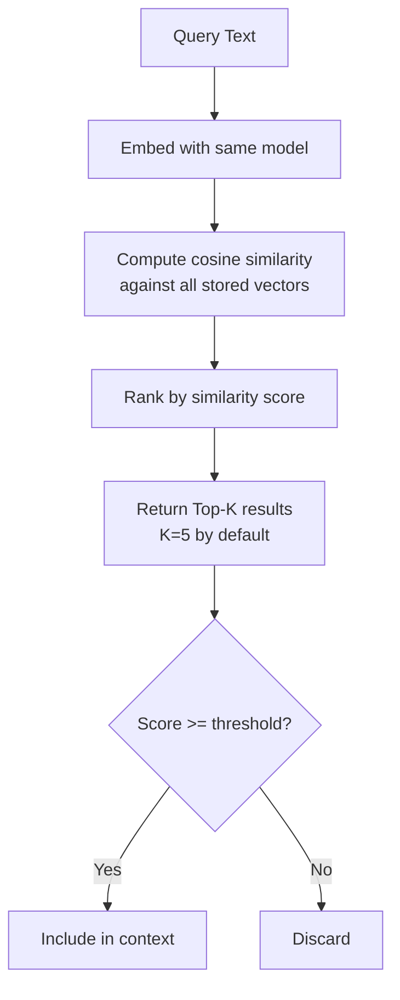

# RAG Explained - A Technical Guide

## 1. What is RAG (Retrieval-Augmented Generation)?

Retrieval-Augmented Generation is an architecture pattern that enhances Large Language Model outputs by injecting relevant information retrieved from an external knowledge base at inference time. Instead of relying solely on the LLM's parametric memory (training data), RAG fetches up-to-date, domain-specific documents and feeds them as context alongside the user query.

The core loop is:

1. **Retrieve** -- Find the most relevant documents for the user's question.
2. **Augment** -- Insert those documents into the LLM prompt as context.
3. **Generate** -- The LLM produces an answer grounded in the provided context.


## 2. RAG vs Fine-Tuning

| Dimension | RAG | Fine-Tuning |
|-----------|-----|-------------|
| **Upfront cost** | Low -- no training required | High -- GPU hours for training |
| **Inference latency** | Moderate -- retrieval + generation | Low -- single forward pass |
| **Accuracy on domain data** | High -- retrieves exact source text | Moderate -- knowledge is compressed into weights |
| **Data freshness** | Real-time -- update documents anytime | Stale -- requires retraining for new data |
| **Hallucination risk** | Lower -- answer is grounded in retrieved text | Higher -- model may confuse memorised facts |
| **Auditability** | Strong -- every answer cites its source | Weak -- no clear link to training data |
| **Maintenance** | Update documents, re-index | Re-train and redeploy model |
| **Infrastructure** | Vector DB + LLM API | GPU cluster for training |

## 3. Why RAG for HR Policies

HR policy management has characteristics that make RAG the optimal choice:

- **Frequent updates** -- Policies change quarterly or annually. RAG allows swapping documents without retraining.
- **Citation requirements** -- Legal and compliance teams require traceable answers back to specific policy sections.
- **Auditability** -- Every response can be verified against the source document and chunk.
- **Low tolerance for hallucination** -- Incorrect HR guidance creates legal risk. RAG grounds answers in retrieved text.
- **Multi-document reasoning** -- Questions may span leave policy, benefits policy, and code of conduct simultaneously.
- **Cost efficiency** -- A small company cannot afford fine-tuning cycles. RAG works with off-the-shelf LLMs.

## 4. Chunking Strategies

Documents must be split into smaller pieces (chunks) before embedding. The chunking strategy directly impacts retrieval quality.

### 4.1 Fixed-Size Chunking

Split text into equal-length segments (e.g., 512 tokens).

| Pros | Cons |
|------|------|
| Simple to implement | Splits mid-sentence or mid-paragraph |
| Predictable token counts | Ignores document structure |
| Easy to parallelise | May separate related information |

### 4.2 Recursive Character Splitting

Split by a hierarchy of separators: paragraph break, newline, sentence boundary, word boundary. Falls back to the next separator when a chunk exceeds the target size.

| Pros | Cons |
|------|------|
| Respects natural text boundaries | Slightly more complex |
| Preserves paragraph coherence | Chunk sizes vary |
| Configurable overlap | Requires tuning separators per format |

**This project uses recursive character splitting** with `chunk_size=512` and `chunk_overlap=64`.

### 4.3 Semantic Chunking

Group sentences by embedding similarity. Adjacent sentences with similar embeddings stay together; a significant shift in similarity triggers a chunk boundary.

| Pros | Cons |
|------|------|
| Chunks are semantically coherent | Computationally expensive |
| Adapts to topic shifts | Requires pre-computation of all sentence embeddings |
| Optimal for diverse documents | Harder to control chunk sizes |

## 5. Embedding Models Comparison

| Model | Dimensions | Size (MB) | MTEB Avg | Speed | Notes |
|-------|-----------|-----------|----------|-------|-------|
| all-MiniLM-L6-v2 | 384 | 80 | 56.3 | Fast | Best balance of speed and quality |
| all-mpnet-base-v2 | 768 | 420 | 57.8 | Medium | Higher quality, 2x larger |
| bge-small-en-v1.5 | 384 | 130 | 58.4 | Fast | BAAI model, strong zero-shot |
| text-embedding-3-small | 1536 | API | 62.3 | API-dependent | OpenAI hosted, per-token cost |
| e5-large-v2 | 1024 | 1300 | 59.2 | Slow | Best local quality, heavy |

**This project defaults to `all-MiniLM-L6-v2`** for local, cost-free operation. The model can be swapped via the `EMBEDDING_MODEL` environment variable.

## 6. Vector Similarity Search Explained

### 6.1 How It Works

Each text chunk is converted into a fixed-length numerical vector (embedding). At query time, the user question is also converted into a vector. The system finds the stored vectors that are closest to the query vector.

### 6.2 Cosine Similarity

The default distance metric. Measures the angle between two vectors, ignoring magnitude.

```
cosine_similarity(A, B) = (A . B) / (||A|| * ||B||)
```

- **1.0** = identical direction (perfect match)
- **0.0** = orthogonal (unrelated)
- **-1.0** = opposite (rare with modern embeddings)

### 6.3 Retrieval Process



### 6.4 Why Top-K + Threshold

- **Top-K** ensures a maximum number of results to control prompt size.
- **Threshold** (0.65) filters out low-quality matches that would inject noise into the context.
- Together they balance recall (finding relevant info) and precision (avoiding irrelevant info).

## 7. Guardrails and Anti-Hallucination Techniques

### 7.1 Prompt-Level Guardrails

- **System instruction**: "Answer ONLY based on the provided context. If the context does not contain the answer, say 'I don't have enough information to answer this question.'"
- **Citation enforcement**: "For every claim, cite the source document and section."
- **Scope restriction**: "You are an HR policy assistant. Do not answer questions outside HR topics."

### 7.2 Retrieval-Level Guardrails

- **Confidence threshold**: Chunks with similarity below 0.65 are discarded.
- **Context token budget**: Maximum 3 000 tokens of context to prevent the LLM from being overwhelmed.
- **Metadata filtering**: Optionally restrict retrieval to specific policy categories or date ranges.

### 7.3 Post-Generation Checks

- **Citation verification**: Ensure every cited source actually appears in the retrieved context.
- **Refusal detection**: If the model says it cannot answer, surface this explicitly to the user rather than fabricating content.

## 8. Evaluation Metrics for RAG

### 8.1 Faithfulness

Measures whether the generated answer is factually consistent with the retrieved context. A faithfulness score of 1.0 means every claim in the answer can be traced to the context.

**How it works**: The evaluator decomposes the answer into individual claims and checks each one against the retrieved passages.

### 8.2 Answer Relevance

Measures whether the answer actually addresses the user's question. A high score means the response is on-topic and useful.

**How it works**: The evaluator generates hypothetical questions from the answer and measures their semantic similarity to the original question.

### 8.3 Context Precision

Measures whether the retrieved chunks are relevant to the question. High precision means few irrelevant chunks were retrieved.

**How it works**: For each retrieved chunk, the evaluator checks if it contains information needed to answer the question.

### 8.4 Context Recall

Measures whether the retrieval captured all the information needed to produce the ground-truth answer. High recall means no critical information was missed.

**How it works**: The evaluator checks whether each sentence in the ground-truth answer can be attributed to at least one retrieved chunk.

### 8.5 Target Scores

| Metric | Target | Acceptable |
|--------|--------|-----------|
| Faithfulness | >= 0.90 | >= 0.80 |
| Answer Relevance | >= 0.85 | >= 0.75 |
| Context Precision | >= 0.80 | >= 0.70 |
| Context Recall | >= 0.85 | >= 0.75 |
