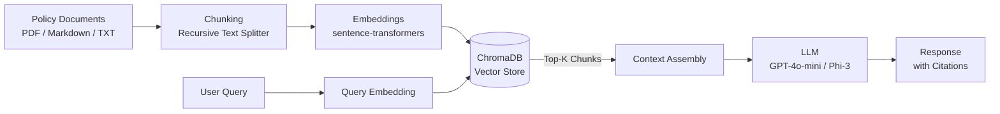
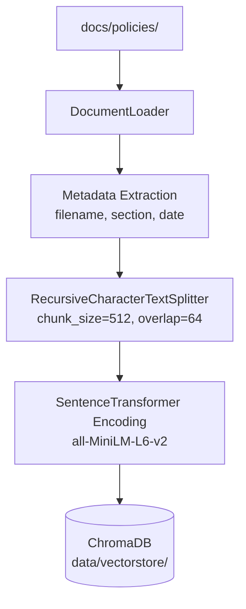
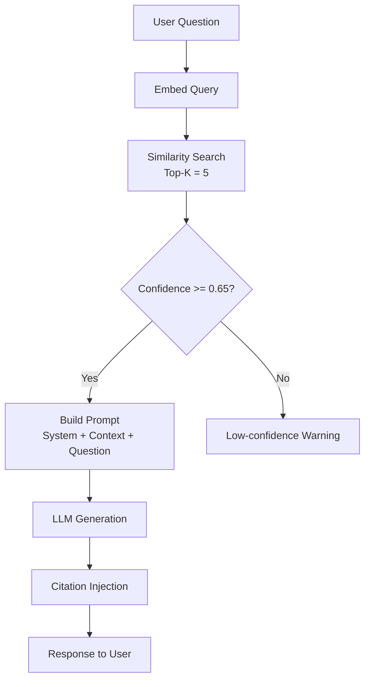

# System Design - HR Policy RAG Assistant

## 1. System Overview

The HR Policy RAG Assistant is a Retrieval-Augmented Generation system that answers employee questions about company HR policies. It retrieves relevant policy excerpts from a vector database and uses an LLM to generate accurate, cited responses.



## 2. RAG Pipeline

### 2.1 Ingestion Flow



1. **Load** -- Read policy files from `docs/policies/` (PDF, Markdown, plain text).
2. **Parse & tag** -- Extract metadata (source file, section headers, effective date).
3. **Chunk** -- Split into 512-token chunks with 64-token overlap using LangChain `RecursiveCharacterTextSplitter`.
4. **Embed** -- Encode each chunk with `sentence-transformers/all-MiniLM-L6-v2` (384-dim).
5. **Store** -- Persist embeddings + metadata in a ChromaDB collection (`hr_policies`).

### 2.2 Query Flow



1. **Embed** the user question with the same embedding model.
2. **Retrieve** top-K (default 5) chunks by cosine similarity.
3. **Filter** -- Discard chunks below the confidence threshold (0.65).
4. **Assemble** -- Pack retrieved chunks into a prompt template with system instructions and guardrails.
5. **Generate** -- Send to the LLM (OpenAI GPT-4o-mini or HuggingFace Phi-3).
6. **Cite** -- Attach source file and section references to the answer.

## 3. Component Architecture

```
src/
├── config/          # Pydantic settings, environment loading
│   └── settings.py
├── data/            # Data utilities, preprocessing helpers
├── rag/             # Core RAG logic
│   ├── document_loader.py   # File reading and metadata extraction
│   ├── chunker.py           # Text splitting strategies
│   ├── embeddings.py        # Embedding model wrapper
│   ├── vector_store.py      # ChromaDB indexing and retrieval
│   ├── retriever.py         # Query pipeline orchestrator
│   └── prompts.py           # Prompt templates with guardrails
├── evaluation/      # RAGAS-based evaluation suite
│   └── evaluator.py
├── api/             # FastAPI REST endpoints
│   └── main.py
└── ui/              # Streamlit dashboard
    └── app.py
```

| Component | Responsibility |
|-----------|---------------|
| `config` | Centralised settings via Pydantic + `.env` |
| `data` | Raw data handling, file format converters |
| `rag` | Document loading, chunking, embedding, retrieval, prompt management |
| `evaluation` | Automated quality metrics (faithfulness, relevance, precision) |
| `api` | REST interface: `/query`, `/health`, `/index` |
| `ui` | Interactive Streamlit chat + analytics dashboard |

## 4. Technology Stack

| Layer | Technology | Version | Purpose |
|-------|-----------|---------|---------|
| Language | Python | >= 3.10 | Runtime |
| Orchestration | LangChain | >= 0.2 | Chains, document loaders, text splitters |
| Embeddings | sentence-transformers | >= 3.0 | Local embedding generation |
| Vector DB | ChromaDB | >= 0.5 | Persistent vector storage |
| LLM | OpenAI / HuggingFace | gpt-4o-mini / Phi-3 | Text generation |
| API | FastAPI + Uvicorn | >= 0.110 | REST API server |
| UI | Streamlit | >= 1.32 | Web dashboard |
| Evaluation | RAGAS | >= 0.1 | RAG quality metrics |
| Validation | Pydantic | >= 2.6 | Schema / settings validation |
| Linting | Ruff | >= 0.3 | Linting and formatting |
| Type checking | mypy | >= 1.8 | Static type analysis |
| Testing | pytest | >= 8.0 | Unit and integration tests |
| Containerisation | Docker + Compose | Latest | Reproducible deployment |

## 5. Design Decisions

### 5.1 Why ChromaDB

- **Zero infrastructure** -- Runs embedded, no separate server needed for development.
- **Persistent storage** -- Writes to disk, survives restarts without re-indexing.
- **Metadata filtering** -- Supports filtering by source file, date, and section at query time.
- **LangChain integration** -- First-class support via `langchain-community`.
- **Trade-off**: Not suitable for multi-billion-document scale; acceptable for enterprise policy corpora (hundreds to low thousands of documents).

### 5.2 Why sentence-transformers (all-MiniLM-L6-v2)

- **Local execution** -- No API call required; reduces latency and cost.
- **Small footprint** -- 80 MB model, 384-dimensional embeddings.
- **Strong performance** -- Top-tier results on MTEB benchmarks for its size class.
- **Deterministic** -- Same input always produces the same embedding (no API variability).

### 5.3 Guardrails Approach

| Guardrail | Implementation |
|-----------|---------------|
| Confidence threshold | Reject retrieval results below 0.65 cosine similarity |
| System prompt constraints | Instruct the LLM to answer only from provided context |
| "I don't know" fallback | If no relevant context is found, the model declines to answer |
| Citation enforcement | Every claim must reference a source chunk |
| Token budget | Context window capped at 3 000 tokens to prevent prompt bloat |
| Input sanitisation | Strip injection attempts and off-topic queries |

## 6. Evaluation Strategy

Evaluation uses the RAGAS framework with the following automated metrics:

| Metric | What It Measures |
|--------|-----------------|
| **Faithfulness** | Is the answer grounded in the retrieved context? |
| **Answer Relevance** | Does the answer address the user question? |
| **Context Precision** | Are the retrieved chunks relevant to the question? |
| **Context Recall** | Does the retrieved context cover the ground-truth answer? |

Evaluation runs against a curated test set stored in `tests/fixtures/` with human-labelled ground-truth answers.

## 7. Security Considerations

| Concern | Mitigation |
|---------|-----------|
| API key exposure | Keys loaded from `.env` (never committed); `.env.example` documents required variables |
| PII in policies | Policies are stored locally; no data leaves the system unless an external LLM provider is used |
| Prompt injection | System prompt instructs model to ignore override attempts; input sanitised before retrieval |
| Network exposure | API binds to `0.0.0.0` only inside Docker; reverse proxy recommended for production |
| Dependency supply chain | Pinned minimum versions in `requirements.txt`; Dependabot recommended |
| Container security | Non-root user in Docker images; minimal base images |
